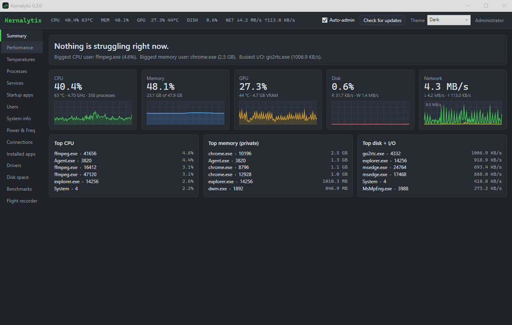

# Kernalytix

A task manager for **Windows and Mac** with every feature included. It shows which process and which part of your computer is slowing things down, right now.

**[⬇ Download the latest version](https://github.com/Ghost-Venom/Kernalytix-Releases/releases/latest)** (`Kernalytix-Setup-…exe` for Windows, `Kernalytix-…-macOS.zip` for Mac)

> This is a test build. This repository only hosts downloads; the source code is private.

## Requirements
- **Windows:** 64-bit Windows 10 (version 2004 or newer) or Windows 11. Nothing else; the installer includes .NET.
- **Mac:** Apple Silicon (M1 or newer) with macOS 13 Ventura or newer.

## Installing on a Mac
1. Download `Kernalytix-<version>-macOS.zip` from [Releases](https://github.com/Ghost-Venom/Kernalytix-Releases/releases/latest) and open it.
2. Drag **Kernalytix** into your **Applications** folder, then open it from there.
3. The app isn't notarized by Apple yet, so the first time macOS says it can't verify the developer. Click **Done**, open **System Settings › Privacy & Security**, scroll down, and click **Open Anyway** next to the Kernalytix message. You only do this once.
4. Optional: click **Full access** (top right) and enter your password. Without it, macOS hides usage for system processes and other users' processes. Full access installs a small background helper that only reads statistics, the way Activity Monitor does. You can turn it off from the same button.

Temperatures, fan speeds and power readings come from macOS's own sensors, so no extra drivers are needed.

## Installing on Windows
1. Download `Kernalytix-Setup-<version>.exe` from [Releases](https://github.com/Ghost-Venom/Kernalytix-Releases/releases/latest).
2. Run it. The installer isn't code-signed yet, so Windows SmartScreen may say *"Windows protected your PC"*. Click **More info**, then **Run anyway**.
3. Choose your options:
   - **Always start as administrator** (recommended). Kernalytix can see every process and control services only as admin. This creates a scheduled task named "Kernalytix Elevated" so it opens as admin with no UAC prompt each time.
   - **Install PawnIO** (optional). Windows has no built-in way to read CPU temperatures. [PawnIO](https://pawnio.eu) is a free, signed driver that lets Kernalytix read CPU core temperatures, motherboard temperatures and fan speeds. GPU temperature works without it.

## Features
| | |
|---|---|
| **Summary** | A plain-English answer to "why is my PC slow?" and the processes responsible |
| **Performance** | CPU per thread, GPU (load, video memory, temperature, fan, power), memory, disk and network |
| **Processes** | Tree view, CPU, GPU, memory and I/O, end task or tree, suspend/resume, priority |
| **Services · Startup apps · Users** | Start/stop services, enable/disable startup items, manage sessions |
| **System info** | OS, CPU, RAM modules, GPU, drives and their health, network adapters |
| **Power & Freq** | Effective CPU clock, power plans, battery, and temperatures for CPU, GPU, motherboard, drives and memory |
| **Connections** | Every open TCP/UDP connection and which program owns it |
| **Installed apps · Drivers** | Desktop and Store apps with uninstall; device and kernel drivers with signing info |
| **Disk space** | A treemap of what's filling each drive |
| **Benchmarks** | CPU, memory and disk speed tests |
| **Flight recorder** | Records up to 6 hours of activity so you can replay a slowdown later |

There are six themes, including green, amber and blue "phosphor" styles.

## Reporting problems
Open an [issue](https://github.com/Ghost-Venom/Kernalytix-Releases/issues) with:
- what you were doing, and what happened
- your Windows version and CPU/GPU
- a screenshot if something looks wrong

Crashes, freezes, readings that don't match Task Manager or HWiNFO, and missing features are all useful.

## Uninstalling
**Windows:** go to **Settings → Apps → Installed apps → Kernalytix → Uninstall**. This also removes the scheduled task and Kernalytix's settings. PawnIO, if installed, stays until you remove it separately.

**Mac:** if you turned on Full access, turn it off first (**Full access ✓ → Turn off full access**). Then drag Kernalytix from Applications to the Trash.

## Third-party software
Kernalytix uses [LibreHardwareMonitor](https://github.com/LibreHardwareMonitor/LibreHardwareMonitor) (MPL-2.0) and other open-source libraries; see [THIRD-PARTY-NOTICES.txt](THIRD-PARTY-NOTICES.txt).
